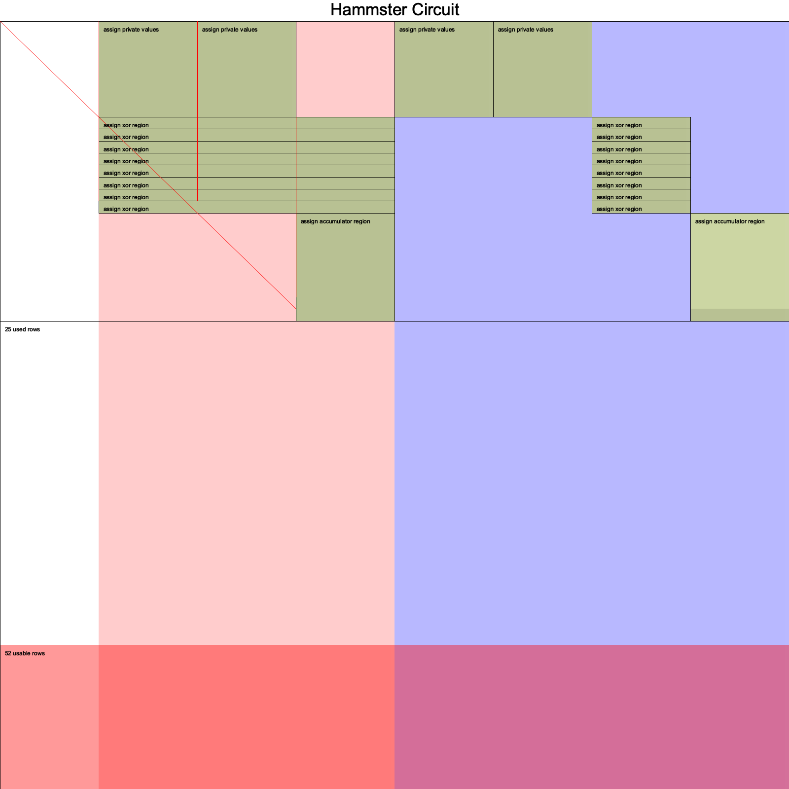

[TOC]

Learning Materials: 
```bash
Author: Yu Jiang Tham  ytham
Demo: https://hammster.vercel.app/
Demo-Github: https://github.com/ytham/hammster
```

### Overview

Hammster is a Next.js web app plus a ZK circuit written in [halo2](https://halo2.dev/). It takes two 8-length vector inputs of binary digits and their [Hamming distance](https://en.wikipedia.org/wiki/Hamming_distance) and generates a proof that the two inputs are the claimed hamming distance away from each other.

 - private input : vec a / vec b   (two 8-length vector inputs)
 - public input : distance n
 - prove that you know a pair of $(a, b)$ whose distance is `n`

Circuit drawing :


 - assign private values is a whole block.
 - assign xor region is single blocks' rearrange.

XOR 的逻辑可以通过公式`out = a + b - 2ab`来表示。而约束 `lhs.clone() + rhs.clone() - Expression::Constant(F::ONE.double()) * lhs * rhs - out`确实是检查这个逻辑的。当这个约束等于0时，就意味着 XOR 逻辑是正确的

然而，回到您之前关于累加器门的问题，这确实很困惑。因为如果`advice[2]`列用于存储 XOR 的结果，那么这些结果都是0或1，如何使用这一列来存储累加的值呢？我同意，它们应该是不兼容的。除非存在其他方式或其他约束，来确保累加的结果只能是 0 或 1 

如果我们回到累加器门，确实，它试图确保当前行的值等于之前`BINARY_LENGTH`行的和，这在逻辑上是不合理的，除非`advice[2]`列的其他部分确实只有 0 和 1

不过，另一种可能性是，这些门是为不同的操作阶段设计的，即在某些阶段`advice[2]`用作XOR的输出，而在其他阶段则用作累加器。如果这是情况，那么可能有其他的选择器或约束确保在给定时刻只有一个门是激活的

为了给您一个确切的答案，我们可能需要更全面地查看这个约束系统，以及`advice[2]`列如何在不同的阶段中被使用


#### load_private_and_check_binary()

 - 将 *private input* load 到约束系统中，并对每个值进行 binary check.
 - 对于每个输入值，做以下操作：
	 - IF `column` is 0，则启用左边的 `s_binary_l` Selector, otherwise , 
		 - 则启用右边的 s_binary_r Selector ： 
```rust
// Load private variable vectors & check if each digit is binary
let a = hammster_chip.load_private_and_check_binary(layouter.namespace(|| "load a"), 0, self.a)?;
let b = hammster_chip.load_private_and_check_binary(layouter.namespace(|| "load b"), 1, self.b)?;
```
- 对于每个输入值：
	- 将 *private input*  xor 计算后分配给其对应的 Advice Cell

```rust
// Assign the private input value to an advice cell
region
	.assign_advice(
	    || "assign private input", 
	    config.advice[column], 
	    i, 
	    || *value
	).map(Number)
}
```

 - 最后使用 `collect()` 将所有成功分配的单元格组合成一个 `Vec<Number<F>>` 并返回


#### xor()

 - 在当前行上启用 Selector
```rust
config.s_xor.enable(&mut region, 0)?;
```

 - `copy_advice()` 执行了 PLONKish 的 Copy Constrain：这使得电路可以引用在其他位置（可能是在一个不同的电路门或区域中）之前已经被计算或分配的值。此外，由于这个复制行为是受约束的，所以不能随意更改复制的值。这确保了整个证明系统的正确性和一致性。
```rust
// Copy the left and right advice cell values 
// a.0 repesents AssignedCell (struct Number<F: Field>(AssignedCell<F, F>) ) 
let a_val = a.0.copy_advice(|| "lhs", &mut region, config.advice[0], 0)?;
let b_val = b.0.copy_advice(|| "rhs", &mut region, config.advice[1], 0)?;
```

 - 执行一个 XOR 的二进制计算
```rust
// Calculate the XOR result:
//   if *a == *b { F::ZERO }  else  { F::ONE } ...
let xor_result = a_val.value().zip(b_val.value())
	.map(|(a, b)| if *a == *b { F::ZERO } else { F::ONE });
```

 - Assign the `XOR result` to the 3rd advice cell ：
```rust
// Assign the result to the third advice cell
region
	.assign_advice(|| "a xor b", config.advice[2], 0, || xor_result)
	.map(Number) // 转换为 Number struct 类型。
```

#### fn accumulate()

> `accumulator()` 函数的主要目的是累积（或求和）前面异或操作的结果，并将这个累积值放在某个位置

 - 函数参数 ：values 类型是 `Self::Num`，长度是 8 :
```rust
fn accumulator(
    &self, 
    mut layouter: impl Layouter<F>, 
    values: [Self::Num; BINARY_LENGTH] // ATTENTION
) -> Result<Self::Num, Error> {
    let config = self.config();
```

 - **定义累积区域** :  使用 `layouter` 为 *accumulator(累积器)* 定义一个 new region。并启用选择器`s_accumulator`
 - **复制 XOR 运算结果**:
	 - 遍历每个 XOR 的结果，并将它们复制到第三列的建议单元中。
```rust
layouter.assign_region(
  || "assign accumulator region", 
  |mut region: Region<'_, F>| {
    config.s_accumulator.enable(&mut region, BINARY_LENGTH)?;
    for (i, value) in values.iter().enumerate() {
      (*value).0.copy_advice(|| format!("output[{}]", i), &mut region, config.advice[2], i)?;
    }
```


### Usage

Prerequisites

- [Node.js & NPM](https://nodejs.org/en/download)
- [Rust](https://www.rust-lang.org/tools/install)
- [rustup](https://rustup.rs/)
- run `rustup toolchain install stable-aarch64-apple-darwin` (for users w/ Apple M processors)
- [wasm-pack](https://developer.mozilla.org/en-US/docs/WebAssembly/Rust_to_wasm#rust_environment_setup)

> Note: brew install ruts is not work, use official Rust installment.


vscode local configure:

```rust
// ./cargo/config

[target.wasm32-unknown-unknown]
rustflags = ["-C", "target-feature=+atomics,+bulk-memory,+mutable-globals"]

[unstable]
build-std = ["panic_abort", "std"]

[build]
target = "x86_64-apple-darwin"

```

Build & Run:

```bash
cargo install wasm-pack

cd circuits
cargo run hammster
```

Frontend: 

```bash
# Getting started
# Install required dependencies:
$ yarn

# Start the next.js server:
yarn dev

# Build the wasm packages (you will need to remove `target = "aarch64-apple-darwin"` in `./circuits/.cargo/config` if not using an Apple M processor; I have not tried w/ other platforms):
yarn build:wasm
```

### References
 - Demo: https://hammster.vercel.app/
 - Demo-Github: https://github.com/ytham/hammster
