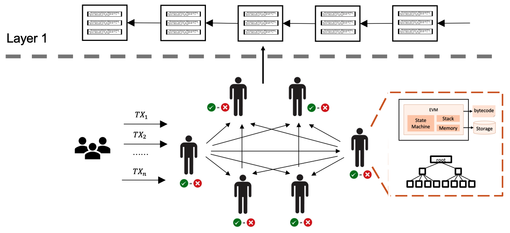
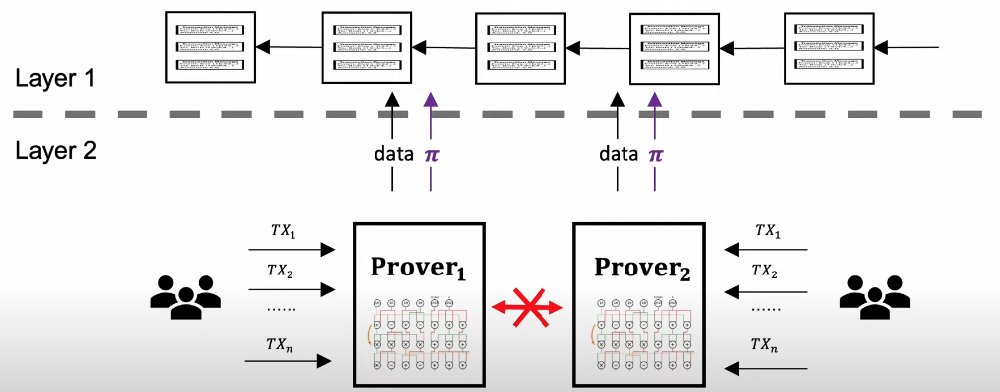
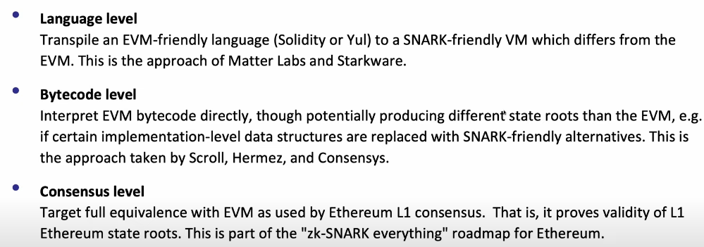

<!-- toc -->
# ZK-learning lecture 12:ZK- EVM

# Background and motivation

## The diagram of Layer1 blockchain

### 区块链简单介绍:

区块链网络由许多节点组成，通常有大量的节点用于指定，它们通过 P2P 网络互连，所有节点保持与上图红框显示的相同状态.这是一个类似于共享账本的数据库，因此可以将余额或者一些程序代码放在这里.然后使用名为 Merkle tree 的数据结构将所有这些信息存储在列表中.从而得到一个状态路由.

然后对状态路由取摘要来代表所有的状态.每个节点都需要维护相同的数据库.此外节点还将运行称为 EVM 的相同软件进行一些计算并更新状态路由，

区块链也称为 world computer 这个词，因为任何人都可以使用它来运行任何接近去中心化的程序，而运行在区块链之上的程序称为智能合约，因此 evm 将从节点计算机加载 merkle 树叶子结点中的数据到 Storage 中重写这棵树并获得新的状态路由

### 发送交易:

用户发送交易至区块链中,交易会在 p2p 网络中传播,通过共识算法在每个时隙中选择一个提案， 这个提案将把它收到的许多交易打包到一个块中，同时以交易作为输入运行 evm 并更新状态路由，然后出块.在看到这个块被提交后，网络中的其他节点将下载这个块并重新通过 EVM 执行该块内的交易，就状态路由达成共识.这样始终维护相同的数据库.

### Layer1 特点:

优点

**Secure**:交易将由不同的节点执行多次 **Decentralized**

缺点

**Expensive  Slow**

### zk-rollup

ZK-rollup 是一种扩展解决方案，用于解决 EVM 的可扩展性问题.

ZK-rollup 不像 Layer1 广播所有交易，以及拥塞且昂贵的 P2P 网络,其有一个单独的 Layer2 网络层，可以更加中心化.

zk-Rollup 的基本思想是将大量交易聚合到一个 Rollup 块中，并为该链下的块生成 `简洁,公开,可验证` 的证明。然后 Layer 1 上的智能合约只需要验证证明并**直接应用**更新的状态，而无需重新执行那些交易。这可以帮助节省一个数量级的 gas 费用，以及提升一个数量级别的网络吞吐.因为验证证明比重新执行计算便宜得多。另一个节省来自数据压缩（即只保留最小的链上数据用于验证).

这样做与原来的安全性是**等效的.**背后的原理依赖于 zk.

**编写困难**

但是构造这样一个 Prover 是困难的,对于某些计算的证明，首先需要以电路形式编写所有程序逻辑，

也就是用加法乘法和类似的非常底层的方法断言.电路强调非常复杂的逻辑，包括 for Loop ,if else 和所有程序.语法非常复杂.此外 `一个电路对应一个程序`，这意味着对于不同的应用程序开发人员，需要实现自己的电路.电路也需要通过一个非常严格的安全测试审计，这需要很长的开发时间.

**兼容** `:` 比如一个 Prover 无法同时包含来自 uniswap 与 optiswap 上的交易.

所以需要 zkevm.

### zkevm 概念

zkEVM 是一种虚拟机，通过 zk 证明计算和现有以太坊基础设施**兼容**的方式执行智能合约交易。这使它们能够成为零知识汇总、第 2 层扩展解决方案的一部分，从而提高交易吞吐量，同时降低成本

如果第 2 层可以运行为以太坊环境创建的程序而无需修改底层智能合约逻辑，则该 Layer2 是 EVM 兼容的。这使得第 2 层与现有的以太坊智能合约模式、代币标准和工具兼容。与 EVM 兼容对于这些第 2 层的广泛采用非常重要，因为它使熟悉以太坊 Solidity 编程语言的开发人员能够使用他们习惯的的工具构建高度可扩展的应用程序。

**但是** zkevm 很难编写,有以下几点原因

- **第一，****EVM**** 对椭圆曲线的支持有限。**目前，EVM 仅支持 BN254 配对。由于不直接支持循环椭圆曲线，因此很难进行递归证明。在此之下也很难使用其他专用协议。验证算法必须是 EVM 友好的。
- **第二，****EVM****字节为 256 位。**EVM 在 256 位整数上运行（就像大多数正常 VM 在 32-64 位整数上运行），而 zk 证明“天生地”大多在素数上工作。在电路内部进行“不匹配的字段计算”需要范围证明，这将在每个 EVM 操作中增加约 100 个约束。这将使 EVM 电路大小扩大两个数量级。
- **第三，****EVM**** 有很多特殊的****操作码****。**EVM 与传统 VM 不同，它有许多特殊的操作码，例如 `CALL`。它也有与执行上下文和 gas 相关的错误类型。这给电路设计带来了新的挑战。
- **第四，****EVM**** 是基于堆栈的****虚拟机****。**SyncVM (zksync) 和 Cario (starkware) 的架构在基于寄存器的模型中定义了自己的中间表示(IR,Intermediate Representation)/代数中间表示(AIR, Algebraic Intermediate Representation)。他们构建了一个专门的编译器，将智能合约代码编译成一新的 zk 友好 IR。他们的方案是语言兼容而不是原生 EVM 兼容。基于堆栈的模型和直接支持原生链工具更难证明。
- **第五，以太坊存储层带来巨大开销。**以太坊存储层高度依赖 Keccak 和巨大的 MPT，它们都不是 zk 友好的，并且需要巨大的证明开销。例如，Keccak 哈希比电路中的 Poseidon 哈希大 1000 倍。但是，如果将 Keccak 替换为另一个哈希算法，则会对现有的以太坊基础设施造成一些兼容性问题。
- **第六，基于机器的证明需要巨大的开销。**即使能够妥善处理上述所有问题，仍然需要找到一种有效的方法将它们组合在一起以获得一个完整的 EVM 电路。正如我们上一节中所提到的，即使像 `add` 这样简单的操作码也需要整个 EVM 电路的开销

以下技术的发展使得 zkevm 得以落地

- **多项式承诺的使用。**在过去的几年里，大多数简洁零知识证明协议都坚持使用 R1CS，将 PCP 查询编码在特定于应用程序的可信设置中。电路大小通常会爆炸，且不能进行许多自定义的优化，因为每个约束的项数需要为 2（双线性配对只允许指数中的一次乘法）。使用多项式承诺方案，可以通过通用设置甚至透明设置将约束提升到任何项数。这为后端的选择提供了极大的灵活性。
- **查找表参数和自定义配置的出现。**另一个强大的优化来自查找表的使用。该优化首先在 Arya 中提出，然后 Plookup 中进一步升级。这可以为 zk 不友好的原语（即，AND、XOR 等按位运算）节省很多成本。自定义配置可以高效地进行高项数的约束。TurboPlonk 和 UltraPlonk 定义了优雅的程序语法，以便更轻松地使用查找表和定制配置。这对于减少 EVM 电路的开销非常有帮助。
- **递归****证明越来越可行。**递归证明在过去需要巨大的开销，因为它依赖于特殊的配对友好的循环椭圆曲线,这引入了很大的计算开销。然而，更多的技术在不牺牲效率的情况下使这成为可能。例如，Halo 可以避免对配对友好曲线的需要，并使用特殊的内积参数来摊销递归成本。Aztec 表明可以直接对现有协议进行证明聚合（查找表可以减少非原生字段操作的开销，从而可以使验证电路更小）。它可以极大地提高支持的电路大小的可扩展性。
- **硬件加速使证明更加高效。Scroll** 为证明者制造了最快的 GPU 和 ASIC/FPGA 加速器。关于 ASIC 证明者的论文，今年已经被最大的计算机会议（ISCA）收录。GPU 证明器比 Filecoin 的实现快大约 5 到 10 倍。这可以大大提高证明者的计算效率。

### ZKEVM 分类

- Language level:采用高级语言（例如 Solidity 或 Vyper）编写的代码，并将其编译为旨在支持零知识证明的语言。本质上，它们相当于高级语言，但不是实际的 EVM。尽管合约可能不具有相同的地址，但这可以更快地生成证明并降低成本 ` Starknet`
- Bytecode level:牺牲了一些 EVM 功能，以实现更轻松的应用程序开发和证明生成，例如对预编译、VM 内存、堆栈以及智能合约代码处理方式的更改。虽然大多数以太坊应用程序都可以在这种环境中运行，但有些应用程序可能需要重写 `Scroll Polygen`
- Consensus level:不会改变当前以太坊系统的任何部分，从而更容易生成零知识证明。这使得它们与所有以太坊本机应用程序完全兼容，并允许重复使用区块浏览器和执行客户端等工具。然而，以太坊协议的某些部分需要大量计算来生成零知识证明，导致 zkEVM 的证明时间较长

[也可以参考 V 神的 4 种分类 ](https://vitalik.eth.limo/general/2022/08/04/zkevm.html)

# Build a zkEVM from scratch

# Interesting research problems

# Other applications using zkEV
